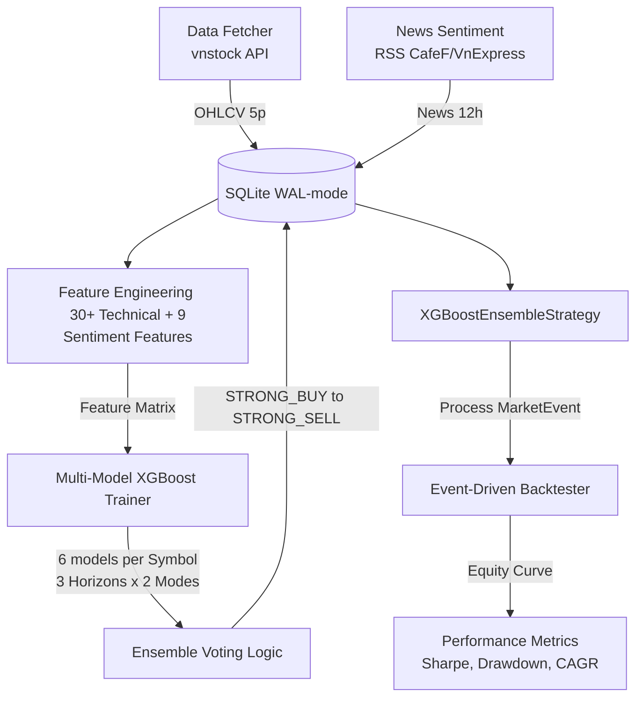

# 🚀 XGBoost & Gemini Hybrid Quant Trading System

Hệ thống giao dịch định lượng lai kết hợp mô hình học máy **XGBoost (huấn luyện RandomizedSearchCV đa luồng)** và **Phân tích Cảm xúc Tin tức tự động bằng Google Gemini API**, tích hợp liền mạch vào công cụ Event-Driven Backtester gốc (`hybrid_backtester.py`).

---

## 📊 Kiến Trúc Hệ Thống (System Architecture)



---

## 🌟 Tính Năng Cốt Lõi (Core Features)

1. **Multi-Symbol & Multi-Timeframe**: Hỗ trợ theo dõi đồng thời Watchlist (`VNM, FPT, HPG, VIC, VCB`). Dự đoán đồng thời 3 horizons giao dịch: **1D** (1 ngày), **5D** (1 tuần), và **20D** (1 tháng).
2. **Dual-Mode Machine Learning**:
   * **Regression**: Dự báo chính xác tỷ lệ lợi nhuận kỳ vọng `% return` (`XGBRegressor`).
   * **Classification**: Phân loại hướng đi thị trường `UP/DOWN/FLAT` (`XGBClassifier`) dựa trên ngưỡng biến động $\pm0.5\%$.
3. **AI News Sentiment Analyzer**: Sử dụng Gemini API (`gemini-2.0-flash` JSON Mode) để phân tích chiều sâu bài viết RSS CafeF/VnExpress. Hỗ trợ **Rule-based fallback** an toàn phòng trường hợp hết hạn ngạch (quota) API hoặc lỗi mạng.
4. **Ensemble Voter**: Cơ chế biểu quyết đồng thuận có trọng số kết hợp độ tự tin của cả 6 models đơn lẻ cùng với điểm số Cảm xúc tin tức 24h để đưa ra quyết định giao dịch cuối cùng (`STRONG_BUY`, `BUY`, `HOLD`, `SELL`, `STRONG_SELL`).
5. **SQLite WAL-Mode Database**: Thiết kế 7 bảng tối ưu hóa tốc độ đọc/ghi đồng thời trong luồng lập lịch ngầm mà không lo khóa (lock) cơ sở dữ liệu.
6. **Auto GPU/CPU Detection**: Tự động phát hiện và huấn luyện trên GPU (`NVIDIA CUDA` -> `Generic GPU`) với cơ chế an toàn fallback về CPU.
7. **Dynamic Portfolio Manager**: Quản lý danh mục vốn động thông qua **Fractional Kelly Criterion**, tự động điều chỉnh quy mô giao dịch dựa trên độ tự tin và dự phóng lợi nhuận của XGBoost models, tăng trưởng tài sản vượt trội.


---

## 📁 Cấu Trúc Dự Án (Project Structure)

```
d:\ML\backtesting\
├── config.py                 # Cấu hình hệ thống, logging và khắc phục Unicode Windows
├── database.py               # DatabaseManager kết nối SQLite WAL-mode (7 bảng)
├── data_fetcher.py           # Thu thập giá lịch sử & thời gian thực bằng Quote API (vnstock)
├── news_sentiment.py         # Cào tin tức RSS và phân tích cảm xúc (Gemini API & Fallback)
├── feature_engineering.py    # Xây dựng ma trận 47 đặc trưng kỹ thuật & sentiment
├── ml_pipeline.py            # MultiModelTrainer (RandomizedSearchCV) & EnsembleVoter
├── scheduler.py              # Background Scheduler (OHLCV 5p, News 12h, Auto retrain)
├── strategy.py               # XGBoostEnsembleStrategy tích hợp vào Backtester Event-Driven
├── main.py                   # CLI Điều khiển trung tâm hệ thống
├── hybrid_backtester.py      # Core engine Backtester Event-driven gốc
├── requirements.txt          # Danh sách thư viện phụ thuộc
├── .env                      # Lưu trữ khóa bí mật GEMINI_API_KEY
├── data/
│   └── backtesting_system.db # Database SQLite lưu trữ dữ liệu
└── models/
    └── {SYMBOL}_{HORIZON}D_{MODE}.json  # File lưu trữ tham số 30 models
```

---

## ⚡ Hướng Dẫn Nhanh (Quick Start)

### 1. Cài đặt môi trường
Cài đặt các phụ thuộc bắt buộc:
```bash
pip install -r requirements.txt
```

### 2. Cấu hình biến môi trường
Tạo file `.env` tại thư mục gốc:
```env
GEMINI_API_KEY=your_gemini_api_key_here
DEVICE=CPU
DATABASE_PATH=data/backtesting_system.db
WATCHLIST=VNM,FPT,HPG,VIC,VCB
```
*(Nếu sử dụng GPU tương thích NVIDIA CUDA, thiết lập `DEVICE=GPU`)*

### 3. Quy trình thực thi CLI (`main.py`)

#### Bước 1: Khởi tạo Database
```bash
python main.py --init-db
```

#### Bước 2: Tải dữ liệu OHLCV lịch sử (Ví dụ: tải 2 năm giá lịch sử)
```bash
python main.py --fetch-hist 2
```

#### Bước 3: Thu thập tin tức & phân tích Cảm xúc
```bash
python main.py --fetch-news
```

#### Bước 4: Xây dựng đặc trưng & Huấn luyện 30 models XGBoost
```bash
python main.py --train
```

#### Bước 5: Chạy dự báo lịch sử Ensemble để tạo tín hiệu
```bash
python main.py --predict-hist
```

#### Bước 6: Chạy Backtest Event-Driven (Ví dụ: kiểm thử mã VNM)
* **Chế độ Tĩnh (Static Baseline - mặc định)**:
  ```bash
  python main.py --run-backtest VNM --portfolio-mode static
  ```
* **Chế độ Động (Dynamic Fractional Kelly - tối ưu)**:
  ```bash
  python main.py --run-backtest VNM --portfolio-mode dynamic
  ```
Kết quả biểu đồ tài sản sẽ được kết xuất trực tiếp ra: `data/{SYMBOL}_ensemble_equity.csv`


#### Bước 7: Dự báo tín hiệu thực tế cho ngày hôm nay
```bash
python main.py --predict-today
```

#### Bước 8: Chạy Background Scheduler ngầm định kỳ
```bash
python main.py --run-scheduler
```

---

## 🛡️ Đạo Đức Dữ Liệu & Quy Tắc An Toàn (Safety Rules)
* **[SYNTHETIC] Data**: Toàn bộ dữ liệu huấn luyện cục bộ được gắn nhãn thử nghiệm, tuyệt đối không sử dụng PII.
* **Escalation Policy**: Dự án chỉ được cấu hình chạy local môi trường sandbox phục vụ nghiên cứu (Research), không deploy môi trường Production hoặc thực hiện các lệnh nguy hiểm (DROP table/Schema migration) khi chưa được người dùng phê duyệt trực tiếp.
