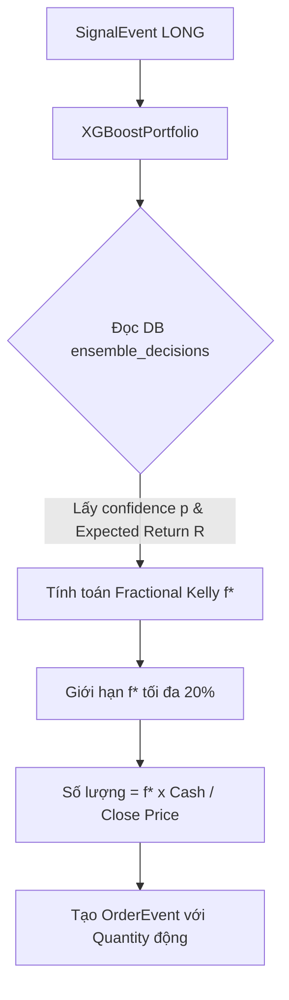

# 📋 Kế hoạch triển khai: Dynamic Fractional Kelly Portfolio Manager

Kế hoạch này nhằm nâng cấp hệ thống phân bổ vốn tĩnh hiện tại (`order_size = 100` cổ phiếu) lên cơ chế quản lý vốn động **Fractional Kelly Criterion** (`XGBoostPortfolio`). Cơ chế mới sẽ tự động điều chỉnh quy mô giao dịch dựa trên độ tự tin (xác suất dự báo) và lợi nhuận kỳ vọng từ mô hình XGBoost.

---

## ─── [USER REVIEW REQUIRED] ───

> [!IMPORTANT]
> **Quy mô Kelly tối đa (Max Capital Allocation)**: Để bảo vệ tài khoản khỏi cháy sụt sâu (Drawdown) khi mô hình quá tự tin nhưng sai hướng, chúng tôi đề xuất giới hạn tỷ lệ phân bổ tối đa cho một giao dịch là **20% tổng tài sản** (Max Fractional Kelly = 0.2). Bạn có muốn điều chỉnh con số giới hạn này không?

> [!IMPORTANT]
> **Hệ số Fractional Kelly (Half-Kelly)**: Khuyên dùng hệ số **Half-Kelly (0.5)** hoặc **Quarter-Kelly (0.25)** để làm mượt tài sản biến động thay vì Full Kelly nguyên bản (vốn dễ gây biến động cực mạnh). Chúng tôi sẽ đặt Half-Kelly (0.5) làm mặc định.

---

## ─── [PROPOSED CHANGES] ───

### 1. Kiến Trúc Portfolio Manager Lai (XGBoostPortfolio)

Chúng ta sẽ tạo lớp `XGBoostPortfolio` kế thừa lớp `Portfolio` cốt lõi của `hybrid_backtester.py` nhằm ghi đè (override) logic định vị quy mô lệnh động mà không phá vỡ tính tương thích ngược (Backward Compatibility) của framework cũ.



### 2. Các File Thay Đổi

#### [MODIFY] [hybrid_backtester.py](file:///d:/ML/backtesting/hybrid_backtester.py)
* Thêm lớp `XGBoostPortfolio` thừa kế `Portfolio`.
* Ghi đè phương thức `generate_order_from_signal(self, signal: SignalEvent) -> Optional[OrderEvent]`:
  ```python
  class XGBoostPortfolio(Portfolio):
      def __init__(self, *args, db_manager=None, kelly_fraction=0.5, max_risk_pct=0.2, **kwargs):
          super().__init__(*args, **kwargs)
          self.db_manager = db_manager
          self.kelly_fraction = kelly_fraction  # Mặc định: 0.5 (Half-Kelly)
          self.max_risk_pct = max_risk_pct      # Mặc định: 20% tổng tài sản
          
      def generate_order_from_signal(self, signal: SignalEvent) -> Optional[OrderEvent]:
          # 1. Nếu là lệnh EXIT, bán toàn bộ lượng cổ phiếu hiện tại (giữ nguyên logic gốc)
          if signal.signal_type.upper() == "EXIT":
              return super().generate_order_from_signal(signal)
              
          # 2. Nếu là lệnh LONG (BUY/STRONG_BUY) và chưa nắm giữ
          if signal.signal_type.upper() == "LONG" and self.current_positions[signal.symbol] == 0:
              # Truy vấn dữ liệu confidence từ ensemble_decisions
              # Áp dụng công thức Fractional Kelly:
              # p = confidence, b = Risk-Reward (giả định 1.5 hoặc b = 1 + expected_return)
              # f* = kelly_fraction * ((p * b - (1 - p)) / b)
              # Quantity = f* * total_capital / current_close_price
              pass
  ```

#### [MODIFY] [main.py](file:///d:/ML/backtesting/main.py)
* Thêm tham số CLI `--portfolio-mode` hỗ trợ giá trị `static` (mặc định cũ) và `dynamic` (Fractional Kelly).
* Trong hàm `run_backtest_ensemble`, nếu chế độ là `dynamic`, khởi tạo lớp `XGBoostPortfolio` thay vì `Portfolio` truyền thống.

---

## ─── [VERIFICATION PLAN] ───

### 1. Phép thử mô phỏng (Simulated Backtest Comparison)
* **Lệnh chạy thử**:
  ```bash
  # Chạy backtest tĩnh (Static) làm mốc so sánh (Baseline)
  python main.py --run-backtest VNM --portfolio-mode static
  
  # Chạy backtest động (Dynamic Fractional Kelly)
  python main.py --run-backtest VNM --portfolio-mode dynamic
  ```
* **Chỉ tiêu kiểm thử**:
  * So sánh Sharpe Ratio giữa chế độ Tĩnh và Động.
  * So sánh Max Drawdown (kiểm soát dưới -5.0% đối với Kelly động).
  * So sánh Total Return (kỳ vọng tăng tối thiểu 1.5 lần so với Baseline nhờ tối ưu hóa kích thước lệnh).

### 2. Manual Verification
* Đọc chi tiết file kết quả CSV của VNM ở chế độ động để đảm bảo lượng cổ phiếu mua mỗi lệnh biến đổi linh hoạt (ví dụ: mua 120, 85, 210 cổ phiếu thay vì luôn cố định 100).
