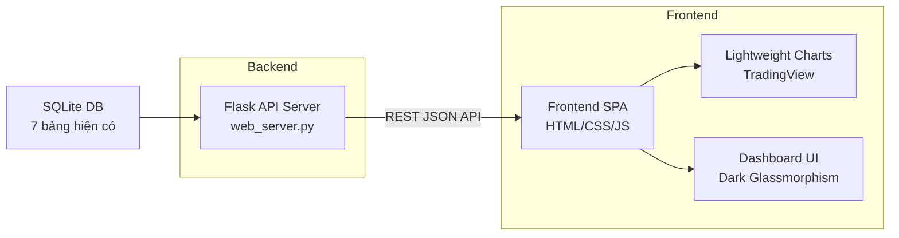

# 📊 Stock Dashboard Web Application

Xây dựng ứng dụng web hiển thị mã chứng khoán với giao diện premium, tích hợp trực tiếp với hệ thống XGBoost & Gemini Hybrid Quant Trading System hiện có. Mục tiêu: cung cấp đầy đủ thông tin cho nhà đầu tư ngắn hạn (1D, 5D) và dài hạn (20D+).

## User Review Required

> [!IMPORTANT]
> **Nguồn dữ liệu**: App sẽ đọc trực tiếp từ SQLite DB hiện có (`data/backtesting_system.db`) với 7 bảng đã thiết kế. Không cần external API key mới nào — toàn bộ dữ liệu đã được pipeline hiện tại thu thập sẵn.

> [!WARNING]
> **Scope**: Plan này tạo web dashboard **chỉ đọc** (read-only) — không thực thi lệnh giao dịch thật. Mọi tín hiệu BUY/SELL chỉ mang tính tham khảo nghiên cứu `[SYNTHETIC]`.

## Open Questions

1. **Watchlist tùy chỉnh**: Có muốn cho phép người dùng thêm/xoá mã cổ phiếu ngoài Watchlist mặc định (`VNM, FPT, HPG, VIC, VCB`) trên giao diện web không?
2. **Auto-refresh**: Có muốn dữ liệu trên dashboard tự động cập nhật real-time (polling mỗi 5 phút khi scheduler đang chạy) hay chỉ cần refresh thủ công?
3. **Responsive mobile**: Có ưu tiên tối ưu cho mobile/tablet hay chỉ cần desktop-first?

---

## Proposed Changes

### Architecture Overview



**Stack chọn lựa**:
- **Backend**: Flask (Python) — tận dụng trực tiếp `DatabaseManager`, `config.py`, và các module ML hiện có. Không cần ORM vì đã có SQLite helper sẵn.
- **Frontend**: Vanilla HTML + CSS + JS — single-page app, không cần framework React/Vue (giữ đơn giản, load nhanh).
- **Charts**: [TradingView Lightweight Charts](https://github.com/nickvdyck/lightweight-charts) — miễn phí, nhẹ, chuyên nghiệp cho financial charting.
- **Styling**: Dark theme + Glassmorphism + micro-animations. Font: Inter (Google Fonts).

---

### Component 1: Backend — Flask API Server

#### [NEW] [web_server.py](file:///d:/ML/backtesting/web_server.py)

Flask server phục vụ REST API + static files. Các endpoint:

| Endpoint | Method | Mô tả | Dùng cho |
|---|---|---|---|
| `/` | GET | Serve `index.html` | Entry point |
| `/api/watchlist` | GET | Trả danh sách mã + giá mới nhất + tín hiệu | Dashboard overview |
| `/api/stock/<symbol>/ohlcv` | GET | Dữ liệu OHLCV (query param: `days=90`) | Candlestick chart |
| `/api/stock/<symbol>/signals` | GET | Lịch sử tín hiệu Ensemble (signal, score) | Signal overlay |
| `/api/stock/<symbol>/indicators` | GET | Features kỹ thuật mới nhất (RSI, MACD, BB) | Technical panel |
| `/api/stock/<symbol>/news` | GET | Tin tức + sentiment score gần nhất | News feed |
| `/api/stock/<symbol>/predictions` | GET | Chi tiết dự đoán 6 model (3 horizon × 2 mode) | Model detail |
| `/api/stock/<symbol>/backtest` | GET | Equity curve từ CSV nếu có | Performance chart |
| `/api/models/status` | GET | Trạng thái huấn luyện model (trained_at, metrics) | Model health |

**Chi tiết triển khai**:
- Import trực tiếp `DatabaseManager` từ [database.py](file:///d:/ML/backtesting/database.py) để query SQLite.
- Sử dụng `flask.jsonify` cho response JSON.
- CORS enabled cho dev mode.
- Static files served từ `web/` directory.

---

### Component 2: Frontend — Dashboard UI

#### [NEW] `web/` directory structure

```
d:\ML\backtesting\web\
├── index.html          # Main SPA entry
├── css/
│   └── style.css       # Design system + Glassmorphism
├── js/
│   ├── app.js          # Main app controller
│   ├── api.js          # API client module
│   ├── charts.js       # Lightweight Charts wrapper
│   └── components.js   # UI component renderers
└── assets/
    └── (icons nếu cần)
```

---

#### [NEW] [index.html](file:///d:/ML/backtesting/web/index.html)

Single-page layout với 4 khu vực chính:

```
┌──────────────────────────────────────────────────┐
│  🔝 TOP BAR: Logo + Watchlist Tabs               │
├──────────┬───────────────────────────────────────┤
│          │                                       │
│  LEFT    │   CENTER: Candlestick Chart           │
│  SIDEBAR │   (Lightweight Charts + Volume)       │
│          │   Signal markers overlay              │
│  • Price │                                       │
│  • Signal├───────────────────────────────────────┤
│  • Score │   BOTTOM PANELS (Tabs):               │
│  • Model │   [Technical] [Signals] [News] [Model]│
│  details │   • RSI/MACD/BB gauges                │
│          │   • Signal history table              │
│          │   • News sentiment feed               │
│          │   • 6-model prediction breakdown       │
│          │   • Backtest equity curve              │
└──────────┴───────────────────────────────────────┘
```

**Tính năng chính phục vụ đầu tư ngắn/dài hạn**:

| Tính năng | Ngắn hạn (1D-5D) | Dài hạn (20D+) |
|---|---|---|
| Tín hiệu Ensemble | ✅ `STRONG_BUY` → `STRONG_SELL` với màu sắc | ✅ Trend dài hạn |
| Biểu đồ nến | ✅ 30-90 ngày, zoom chi tiết | ✅ 1-2 năm overview |
| RSI / MACD | ✅ Overbought/Oversold indicators | ✅ Divergence detection |
| Bollinger Bands | ✅ Squeeze / breakout | ✅ Volatility channel |
| News Sentiment | ✅ Impact 24h gần nhất | ✅ Trend cảm xúc dài hạn |
| Model Confidence | ✅ Chi tiết xác suất UP/DOWN/FLAT | ✅ Expected return % |
| Backtest Performance | — | ✅ Equity curve, Sharpe, Drawdown |
| Multi-timeframe Score | ✅ 1D weight 50% | ✅ 20D weight 20% |

---

#### [NEW] [style.css](file:///d:/ML/backtesting/web/css/style.css)

Design system:

- **Color palette**:
  - Background: `#0a0e17` (deep space dark)
  - Surface: `rgba(15, 23, 42, 0.8)` với backdrop blur (glassmorphism)
  - Accent: `#3b82f6` (electric blue), `#10b981` (profit green), `#ef4444` (loss red)
  - Gradient accents: `linear-gradient(135deg, #667eea, #764ba2)`
  - Text: `#e2e8f0` (primary), `#94a3b8` (secondary)
- **Typography**: Inter (Google Fonts), monospace cho giá số
- **Glassmorphism cards**: `background: rgba(15, 23, 42, 0.6); backdrop-filter: blur(16px); border: 1px solid rgba(255,255,255,0.08)`
- **Micro-animations**:
  - Price change flash (green/red pulse)
  - Card hover lift + glow
  - Signal badge shimmer
  - Smooth tab transitions
  - Loading skeleton shimmer
- **Responsive**: CSS Grid + Flexbox, breakpoint tại 768px (tablet) và 480px (mobile)

---

#### [NEW] [app.js](file:///d:/ML/backtesting/web/js/app.js)

Main controller:
- Khởi tạo app, load watchlist, render sidebar
- Handle tab switching (symbol selection)
- Orchestrate data fetching → chart rendering → panel updates
- Timeframe selector (30D / 90D / 180D / 1Y / 2Y)

#### [NEW] [api.js](file:///d:/ML/backtesting/web/js/api.js)

API client:
- Fetch wrapper với error handling
- Endpoint helpers cho mỗi route
- Response caching (optional)

#### [NEW] [charts.js](file:///d:/ML/backtesting/web/js/charts.js)

TradingView Lightweight Charts integration:
- Candlestick series + Volume histogram
- Signal markers (triangle UP green = BUY, triangle DOWN red = SELL)
- SMA/EMA overlay lines
- Bollinger Bands area
- Equity curve line chart (backtest tab)
- RSI sub-chart
- Responsive resize handling

#### [NEW] [components.js](file:///d:/ML/backtesting/web/js/components.js)

UI component renderers:
- `renderWatchlistCard(symbol, data)` — sidebar card với giá, % change, signal badge
- `renderTechnicalPanel(indicators)` — RSI gauge, MACD bars, BB position
- `renderSignalHistory(signals)` — sortable table với signal, score, timestamp
- `renderNewsFeed(articles)` — card list với sentiment color coding
- `renderModelBreakdown(predictions)` — 6 model chi tiết (3 horizon × 2 mode)
- `renderBacktestSummary(metrics)` — Sharpe, Max Drawdown, CAGR, Total Return

---

### Component 3: Dependencies & Config

#### [MODIFY] [requirements.txt](file:///d:/ML/backtesting/requirements.txt)

Thêm:
```diff
+flask>=3.0.0
+flask-cors>=4.0.0
```

---

## Verification Plan

### Automated Tests

1. **Khởi động server**:
   ```bash
   python web_server.py
   ```
   Kiểm tra server chạy trên `http://localhost:5000`

2. **API endpoint tests** (manual via browser):
   - `GET /api/watchlist` → trả JSON list mã cổ phiếu
   - `GET /api/stock/VNM/ohlcv?days=90` → trả OHLCV data
   - `GET /api/stock/VNM/signals` → trả signal history

3. **Frontend rendering**:
   - Mở `http://localhost:5000` trên browser
   - Kiểm tra candlestick chart hiển thị đúng
   - Click từng mã trong watchlist → dữ liệu cập nhật
   - Chuyển tab Technical/Signals/News/Model → panel render đúng
   - Responsive: resize browser → layout adaptive

### Manual Verification

- Kiểm tra visual: dark theme, glassmorphism blur, micro-animations
- Cross-check tín hiệu BUY/SELL trên UI với dữ liệu trong DB (`ensemble_decisions`)
- Verify RSI/MACD values trên UI khớp với `features` table

> [!NOTE]
> **[ESTIMATE] Effort**: ~6-8 files mới, ~500-800 dòng backend + ~1500-2000 dòng frontend. Thời gian thực thi ước tính: 1 phiên coding.
